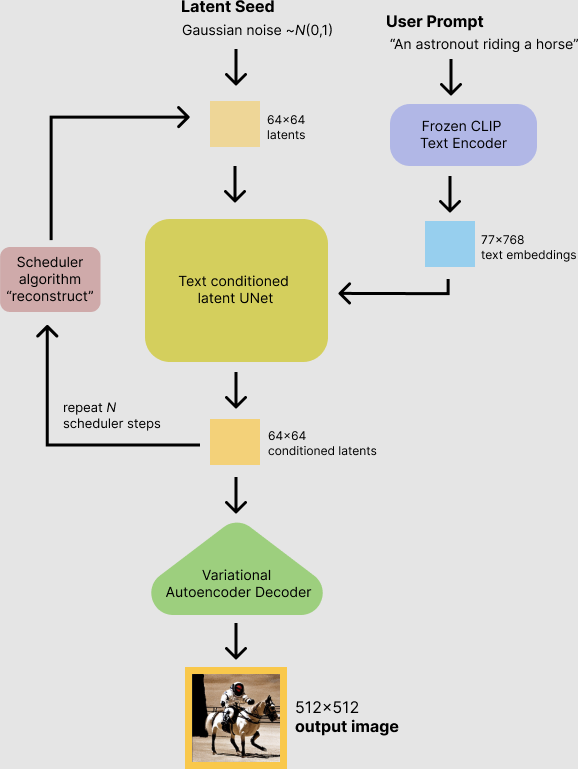

# Huggingface diffusers study

Attention을 denoising Unet에 넣을 때 CLIP Text Encoder를 사용함 (논문에서는 자세한 방법이 언급 되지 않음)

Decoder 또한 VAE decoder를 사용 DDPM 논문을 통해서 그대로 사용된다는 것을 유추 가능 

Scheduler를 통해서 denoising step을 반복함

